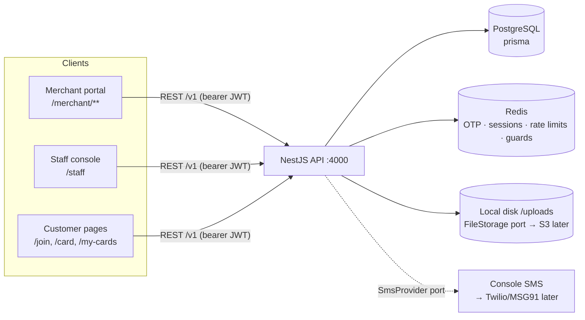

# Architecture — Phase 1

This document explains the load-bearing decisions. Read the [README](../README.md) first for
setup and the feature map.

## System overview



One Next.js app serves all three user types; one NestJS API serves all surfaces under `/v1`.
Swagger lives at `/docs`.

## Multi-tenancy

- **The tenant is the `Business`.** Merchant, staff and campaign/membership/stamp rows all
  hang off it.
- **Customers are global identities** (unique phone), joined to tenants through
  `CustomerMembership`. This is deliberate: one person holds cards at many businesses, and
  later phases (wallet passes, cross-merchant analytics, one login for all cards) need a
  single customer identity.
- **Isolation is enforced at the service layer:** every tenant-scoped query filters by a
  `businessId` that comes from the authenticated actor (staff → their `businessId`; merchant →
  their owned business via `requireBusiness()`). Client-supplied ids are only ever used
  *together with* that filter, so cross-tenant probes 404. The E2E suite asserts this.
- Row-level security in Postgres was considered and deferred: RLS pays off once raw SQL or
  many services touch the DB. With a single API and Prisma-only access, service-layer scoping
  plus targeted tests is simpler and equally effective at this stage.

## Data model (Prisma)

```
Merchant 1—1 Business 1—N Campaign 1—N CustomerMembership N—1 Customer
                     1—N Staff              1—N Stamp (immutable event)
                                            1—N Redemption (reward voucher)

Platform domain (no tenant column, never joined into tenant queries):
PlatformAdmin —N AuditLog (append-only)
             —N ImpersonationSession —1 Business
```

Key columns on `CustomerMembership` (the "card"):

| Column | Meaning |
|---|---|
| `code` | unique 8-char customer ID (unambiguous alphabet, shown `XXXX-XXXX`) |
| `stampCount` | stamps on the current card, `0 … stampsRequired-1` |
| `completedCount` | rewards earned (completed cards) |
| `totalStamps` | lifetime counter, immune to campaign edits |
| `lastStampAt` | denormalised for sorting/search recency |

`Stamp` rows are an append-only audit log (issuer, completion flag, timestamp) — the source
of truth for history, activity feeds and future analytics/billing.

## Authentication & sessions

Three actor roles — `MERCHANT`, `STAFF`, `CUSTOMER` — with separate tables (their lifecycles
and relations differ; a shared `users` table bought nothing but conditionals).

**OTP flow** (all roles): `request` → SMS code → `verify`.

- Codes: 6 digits, `sha256(phone:code:pepper)` in Redis, 5 min TTL, max 5 attempts,
  60 s resend cooldown, 5 sends/hour/phone. Verification is timing-safe and single-use.
- New merchant/customer phones get a short-lived **registration token** from `verify`,
  exchanged (with a name) at `register` — so account creation still proves phone possession.
  Staff can't self-register; merchants create them.

**JWTs:** access (15 min, stateless) + refresh (30 d, stateful). Each refresh token carries a
`jti` that must exist in Redis (`sess:{role}:{id}:{jti}`); refresh **rotates** the session and
logout revokes it. The auth guard re-loads the actor from the DB per request, so deactivating
a staff member locks them out immediately, not at token expiry.

**Guard model:** `JwtAuthGuard` + `RolesGuard` are registered globally — everything is
authenticated unless explicitly `@Public()`. Controllers declare `@Roles('MERCHANT')` etc.

**Web sessions:** one localStorage session per portal (`loyalty.session.merchant|staff|customer`),
so a single browser can be merchant + staff + customer simultaneously — intentional for solo
owners and demos. Trade-off: localStorage is XSS-readable; mitigations are short access-token
life + revocable refresh tokens; the Phase 2 hardening path is httpOnly cookie sessions per
subdomain. The typed API client auto-refreshes once on 401 (single-flight) and clears the
session on failure; portal guards then redirect.

A subtle frontend rule learned the hard way: session state is `null` during SSR/hydration, so
`useStoredSession` exposes a `ready` flag and **no redirect or inline-login decision happens
until it's true** — otherwise every full page load bounces through the login route.

## Stamping correctness (the money path)

`StampsService.addStamp` must survive two staff double-tapping and racing requests:

1. **Double-tap guard:** Redis `SET NX` on `stampguard:{businessId}:{membershipId}` (3 s TTL);
   scoped by tenant so outsiders can't observe or trip it. Released on failure.
2. **Atomic increment:** single `UPDATE … SET stamp_count = stamp_count + 1` (row-level
   atomicity — two racers get distinct values).
3. **Conditional completion:** `UPDATE … WHERE stamp_count >= required` decrements by
   `required` and increments `completedCount`. If two stamps race past the threshold, only one
   matches the predicate → exactly one reward; the other stamp correctly lands on the fresh
   card.
4. Stamp event row records `completedCard` for history/celebration UI.

Covered by unit tests (`stamps.service.spec.ts`) and the E2E smoke script.

## Redemption (closing the loyalty loop)

A `Redemption` is a voucher: minted when a card completes, honoured at the counter.

- **Minted inside the stamp transaction.** `StampsService` calls
  `RedemptionsService.createForCompletion(tx, …)` in the same Postgres transaction that
  increments the card, so an earned reward can never exist without its voucher. Code
  uniqueness is pre-checked rather than retried on insert — a unique violation would abort
  the surrounding transaction.
- **Reward text is snapshotted.** Editing a campaign's reward later never rewrites what an
  existing voucher promised.
- **Redeeming is race-safe.** The status flip is `updateMany(… WHERE status = 'PENDING')`;
  exactly one of two concurrent redeems matches, the other gets `ALREADY_REDEEMED` (409).
- **Tenant-scoped like everything else** — the voucher lookup filters by the caller's
  `businessId`, so another tenant's voucher 404s.
- **Two entry points**, both landing in the same service: staff (`POST /staff/redemptions/redeem`)
  and merchant owner (`POST /merchant/redemptions/redeem`), each recording `redeemedByType`
  and the staff id.
- `completedCount − pendingRewards` gives "rewards actually handed over", which is what the
  dashboard reports. Completions that predate this feature count as already honoured.

## Merchant reporting and corrections

- **The stamp table is a signed ledger.** Every row carries a `delta` (+1 for a normal stamp,
  ±N for an owner correction) and an optional `reason`. Balance changes are therefore always
  append-only events, never in-place edits of a counter — a disputed balance can be explained
  line by line.
- **Adjustments reuse the completion path.** A positive correction that crosses the threshold
  mints a reward voucher exactly like a stamp would, so there is one code path for "card
  completed" and no way to earn a reward that skipped voucher creation.
- **Dates bucket in the tenant's timezone.** `Business.timezone` drives every "today" and every
  daily bucket in analytics, using `Intl.DateTimeFormat` for the zone conversion rather than
  server-local time. A café that closes at 1am sees one night, not two days.
- **Fraud rails live on the campaign.** `dailyStampCap` is enforced inside the stamping
  transaction, counting only real stamps (adjustments are exempt, since they are the owner's
  deliberate correction).
- **Consent is a ledger too.** Each grant or withdrawal appends a row capturing the exact
  wording shown, its version, the channel and the IP. Editing the wording bumps
  `consentTextVersion`, so historic agreements stay attached to the text the customer actually
  saw rather than the current draft.

## Undo (the counter's oops button)

Undo is a first-class ledger operation, not a delete:

- The undone stamp row is **marked** (`undoneAt`, `undoneByStaffId`) and a **delta −1
  reversal row** is appended in the same transaction. Sums over the ledger remain correct,
  and both sides of the mistake stay visible in history.
- Only the **newest standing entry** can be undone (reversals and already-undone rows are
  ignored when finding it). If anything happened after — another stamp, an owner
  adjustment — the undo is refused; corrections beyond that are the owner's adjust tool.
- **Windows are role-based**: staff undo their own stamp within 60 s; managers undo
  anyone's within 15 min. Enforced server-side from `Staff.role`, mirrored in the UI as a
  live countdown.
- **Completions roll back atomically**: `completedCount` decrements, the card returns to
  `required − 1`, and the voucher minted by that stamp (found via `earnedByStampId`) flips
  PENDING → VOID. A voucher already REDEEMED blocks the undo — money that left the till
  stays accounted for. The claim (`updateMany … WHERE undoneAt IS NULL`) is the mutex, so
  two racing undos can't both fire.
- The **daily cap counts only standing stamps** (`delta > 0 AND undoneAt IS NULL`), so an
  undone mistake gives the customer their allowance back.
- Analytics sums signed deltas, so an undo pair cancels out instead of inflating charts.

## Wallet passes

- **Apple**: a `.pkpass` is a ZIP (pass.json + icons + SHA-1 manifest +
  PKCS#7 detached signature via the Pass Type ID certificate chained through
  Apple's WWDR CA). We implement Apple's full pass web service — device
  registration, `passesUpdatedSince`, conditional pass fetch (304s), logging
  — plus APNs pushes over HTTP/2 using the same certificate, so passes update
  seconds after a stamp.
- **Google**: one LoyaltyClass per business, one LoyaltyObject per card,
  maintained over REST (OAuth2 service-account flow, plain fetch). The save
  button is a signed RS256 JWT that *embeds* the object, so it works even if
  a REST call hiccups; updates PATCH the object and Google fans out.
- **Change propagation**: loyalty services call `wallet.cardChanged(id)`
  after their transactions commit — fire-and-forget, so a wallet outage can
  never break stamping. Cards without a wallet pass are a no-op.
- **Credential gating**: each wallet reads its config lazily and reports
  availability; the UI shows real buttons only for configured wallets. Dev
  fixtures (self-signed CA + fake service account) exercise the entire
  pipeline in tests, verified down to `openssl smime -verify` and RS256
  signature checks.
- The **pass barcode is the customer code** — one identity across web card,
  wallet pass and counter scanner.

## The admin (platform) domain

Deliberately a separate world from the tenant domain:

- **Separate table.** `PlatformAdmin` has no `businessId` and never will. A platform admin is
  not a tenant user with extra flags.
- **Separate credential family.** Admin tokens are signed with a different secret from tenant
  access tokens, so a leaked tenant secret cannot mint an admin session, and a tenant token
  presented to an admin route fails signature verification before any lookup happens.
- **Separate guard.** `AdminAuthGuard` handles `@AdminRoute()`; the tenant `JwtAuthGuard` and
  `RolesGuard` short-circuit on those routes. Both directions are covered by the E2E suite
  (merchant token → admin route = 401, and the reverse).
- **Mandatory two-factor.** Password verifies first and returns only a short-lived interim
  token; a TOTP code (or a single-use recovery code) is required to obtain a session. Failed
  password attempts are rate-limited per email and lock out after five, alerting via the audit
  log. Unknown emails are verified against a dummy hash so response timing doesn't reveal
  whether an account exists.
- **Capability model.** `ADMIN_CAPABILITIES` maps capability → allowed roles as data in one
  place, rather than scattered role checks. Routes declare `@RequireCapability('merchants.suspend')`
  and the guard enforces it. Moving this to the database for custom roles is a contained change.
- **Shorter sessions.** 15-minute access tokens, 12-hour refresh (vs 30 days for tenants),
  maximum three concurrent sessions, and deactivation revokes every session immediately.

### Audit log

Append-only, written by `AuditService`, exposed read-only — there is no update or delete path
in the API at all. Writes deliberately **never throw**: an action that succeeded must not be
reported as failed because its log entry didn't persist, so failures are logged and swallowed.
Actor labels are captured at write time so an entry survives the actor being deleted.

Every admin action records who, what, which tenant, from what IP, and — for impersonation,
suspension and customer lookup — a mandatory reason. Looked-up phone numbers are masked in the
log itself, so reading the audit trail never re-exposes the PII the entry is about.

### Suspension

`Business.suspendedAt` is checked in three places, so a suspension takes effect everywhere at
once: the OTP request path (before an SMS is sent), the per-request auth guard (killing live
sessions mid-flight), and the public join/enrolment path. The join page reports "not accepting
joins" without disclosing that the account was suspended.

## "Updates immediately"

The customer card polls `GET /customer/cards/:id` every 4 s while visible (React Query
`refetchInterval`), diffing `totalStamps` to fire the stamp animation/toast. Polling was chosen
over WebSockets/SSE for Phase 1: it needs zero extra infrastructure, survives proxies and
sleep/wake, and 4 s is imperceptible at a counter. The upgrade path (Phase 2+) is SSE backed by
Redis pub/sub — the API already has the Redis plumbing.

## API conventions

- Versioned prefix `/v1`; Swagger at `/docs` with bearer auth and typed response DTOs.
- Errors are one envelope: `{ statusCode, code, message, details?, retryAfterSec?, requestId,
  path, timestamp }`. `code` is machine-stable (`OTP_INVALID`, `STAMP_COOLDOWN`,
  `CAMPAIGN_LIMIT`, …) so the frontend branches on codes, never message text.
- Validation: global `ValidationPipe` (whitelist + transform) over class-validator DTOs;
  phones normalised to E.164 (`libphonenumber-js`, default region `DEFAULT_PHONE_REGION`).
- Rate limiting: `@nestjs/throttler` with a custom Redis storage (multi-instance correct);
  stricter per-route limits on OTP endpoints; domain limits (cooldowns, hourly caps) in Redis.
- Pagination: `?page&limit` → `{ items, total, page, pageSize, totalPages }`.
- Request logging with request-ids; helmet; CORS restricted to `CORS_ORIGINS`.

## Ports & adapters (future-phase seams)

| Port | Dev implementation | Later |
|---|---|---|
| `SmsProvider` | console logger | Twilio / MSG91 / WhatsApp OTP |
| `FileStorage` | local disk at `/uploads` | S3/GCS (same relative-path contract) |
| `ThrottlerStorage` | Redis | unchanged at scale |
| Card rendering | browser page | + Apple/Google Wallet pass generators |

## Phase 1 product limits (service-level, not schema-level)

- One business per merchant (`Business.merchantId` unique — drop for multi-outlet).
- One live campaign per business (checked in `CampaignsService.create`).
- Staff phone globally unique (relax to `(businessId, phone)` for multi-business staff).

## Testing

- **Unit (Jest):** OTP lifecycle (cooldowns, attempts, role scoping), stamp completion +
  concurrency semantics, code/slug utilities. `npm test` — 19 tests.
- **E2E smoke script** — `apps/api/test/smoke.sh` (49 assertions): full merchant → customer →
  staff journey, tenant isolation, role guards, token rotation. Run it against a freshly
  seeded API (`npm run db:seed`, then `bash apps/api/test/smoke.sh`); promote to a Jest e2e
  suite when CI lands.
- **Browser verification:** all 12 Phase 1 features exercised manually via the dev servers,
  including the live cross-tab stamp update.
